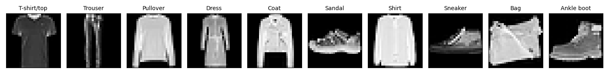

# Neural Network Training for Fashion-MNIST | DA6401 Assignment 1 | Introduction to Deep Learning



## Overview
This repository provides a neural network training framework for the Fashion-MNIST dataset, with support for various hyperparameter configurations, optimizer choices, weight initializations, and logging with Weights & Biases (WandB). The training script allows users to fine-tune models through command-line arguments.
The goal of this assignment is twofold: (i) implement and use gradient descent (and its variants) with backpropagation for a classification task (ii) get familiar with Wandb which is a cool tool for running and keeping track of a large number of experiments.

Report : [Report Link](https://wandb.ai/da24s011-indian-institute-of-technology-madras/neural-network-fashion-mnist/reports/DA24S011-DA6401-Assignment-1--VmlldzoxMTU3NTA0MA)

## Installation
Ensure you have Python installed. To set up the environment and install dependencies, run:

```bash
pip install -r requirements.txt
```

## Usage
The training script can be executed with various command-line arguments to configure hyperparameters.

### Basic Training Command
Run the following command to train the neural network with default settings:

```bash
python train.py
```

### Custom Training with Arguments
You can customize training by specifying different arguments. Here is the arguments that gave good scores:

```bash
python3 train.py --learning_rate 0.001 --activation relu --hidden_layers_count 4 --hidden_layer_size 128 --optimizer sgd --weight_init he -epochs 40 --weight_decay 0.0005 -dataset fashion_mnist
```

### Train Using WandB and WandB Sweeps for Experiment Tracking
```bash
python train_nn.py --use_wandb True --use_wandb_sweep True --wandb_project "my_nn_project" --wandb_entity "musername"
```

# Project Structure

### `/configs`
Configuration files for experiments and model parameters.
- `sweep_config.py`: Configuration for hyperparameter sweeps

### `/models`
Neural network model definitions.
- `neural_network_sweep.py`: Model architecture definitions for sweep experiments

### `/optimizers`
Optimization-related components.
- `__init__.py`: Initializes the optimizers package
- `optimizers.py`: Custom optimizers and learning rate schedulers

### `/utils`
Utility functions and helper modules.
- `__init__.py`: Initializes the utils package
- `activations.py`: Custom activation functions
- `data_utils.py`: Data loading, preprocessing, and augmentation utilities
- `losses.py`: Custom loss functions

### Root Files
- `question1.py`: Main script for question 1 implementation
- `README.md`: Project documentation (this file)
- `references.txt`: Citations and references
- `requirements.txt`: Project dependencies
- `train.py`: Main training script

---
### Arguments Explanation

#### **Weights & Biases Integration**
| Argument | Type | Default | Description |
|----------|------|---------|-------------|
| `-uw`, `--use_wandb` | str | "True" | Enable Weights & Biases tracking. Set to 'true' to log training details. |
| `-uw_s`, `--use_wandb_sweep` | str | "false" | Enable hyperparameter sweeps using WandB. |
| `-wp`, `--wandb_project` | str | "fashion-mnist-hyperparameter-sweep" | Name of the WandB project. |
| `-we`, `--wandb_entity` | str | "utkarsh" | WandB entity name (username) for logging experiments. |

#### **Dataset Selection**
| Argument | Type | Default | Description |
|----------|------|---------|-------------|
| `-d`, `--dataset` | str | "fashion_mnist" | Dataset to train on. Options: `mnist`, `fashion_mnist`. |

#### **Training Parameters**
| Argument | Type | Default | Description |
|----------|------|---------|-------------|
| `-e`, `--epochs` | int | 40 | Number of training epochs. |
| `-b`, `--batch_size` | int | 32 | Number of samples per training batch. |

#### **Loss Function**
| Argument | Type | Default | Description |
|----------|------|---------|-------------|
| `-l`, `--loss` | str | "cross_entropy_loss" | Loss function. Options: `mean_squared_error`, `cross_entropy_loss`. |

#### **Optimizer Settings**
| Argument | Type | Default | Description |
|----------|------|---------|-------------|
| `-o`, `--optimizer` | str | "sgd" | Optimizer choice. Options: `sgd`, `momentum`, `nag`, `rmsprop`, `adam`, `nadam`. |
| `-lr`, `--learning_rate` | float | 0.001 | Learning rate for optimization. |
| `-m`, `--momentum` | float | 0.9 | Momentum value (applicable for momentum-based optimizers). |
| `-beta`, `--decay_rate` | float | 0.9 | Decay rate for RMSprop. |
| `-beta1`, `--beta1` | float | 0.9 | Beta1 parameter for Adam/Nadam. |
| `-beta2`, `--beta2` | float | 0.999 | Beta2 parameter for Adam/Nadam. |
| `-eps`, `--epsilon` | float | 1e-6 | Small constant to prevent division by zero. |

#### **Regularization**
| Argument | Type | Default | Description |
|----------|------|---------|-------------|
| `-w_d`, `--weight_decay` | float | 0.0005 | L2 weight decay for regularization. |

#### **Weight Initialization**
| Argument | Type | Default | Description |
|----------|------|---------|-------------|
| `-w_i`, `--weight_init` | str | "random" | Weight initialization method. Options: `he`, `random`, `Xavier`. |

#### **Network Architecture**
| Argument | Type | Default | Description |
|----------|------|---------|-------------|
| `-n_hl`, `--hidden_layers_count` | int | 4 | Number of hidden layers. |
| `-sz`, `--hidden_layer_size` | int | 128 | Number of neurons per hidden layer. |

#### **Activation Function**
| Argument | Type | Default | Description |
|----------|------|---------|-------------|
| `-a`, `--activation` | str | "relu" | Activation function. Options: `sigmoid`, `tanh`, `ReLU`. |

<br>


### Custom Training with MNIST Digit Dataset
You can customize training by specifying different arguments. Here is the arguments that gave good scores:

```bash
python3 train.py --learning_rate 0.001 --activation relu --hidden_layers_count 4 --hidden_layer_size 128 --optimizer sgd --weight_init he -epochs 40 --weight_decay 0.0005 -dataset mnist
```
---
**Work done for the course `Introduction to Deep Learning`. Please raise an issue if the code doesn't work propely for any case.**

